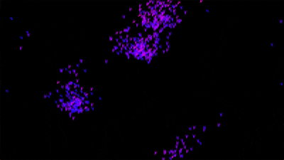

# Showcase Video

  
   
  <em>Click the image to watch the video</em>

# Boids or Flocks

Boids are little agents that move according to simple rules. This results in amazing behaviour.

This is a simulator where you can customise their behaviour and experiment with them as you like.

# Usage
When executed you can see the keys to contol their behaevour.

# Links
See an example at: https://boids.cubedhuang.com

---

<!-- portfolio-gallery:start -->
## Gallery

  
  
  
  
  
  
  
  
  
  

<!-- portfolio-gallery:end -->
